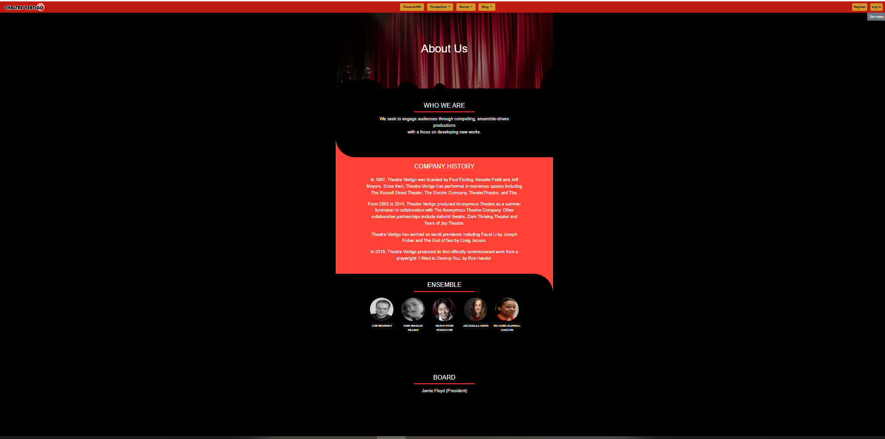
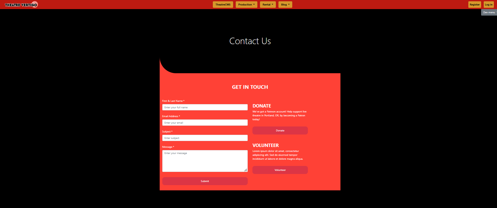

# 👋 Hi there, I'm Edwin Addai - TechAcademy

Welcome to my GitHub! I'm a passionate software developer who focuses on creating meaningful and impactful projects. This repository contains my Capstone Project, in which I utilized various technologies, such as .NET Core, Entity Framework, SQL, Bootstrap, JavaScript, and more, to build a functional application for a theater company.

## 📚 Capstone Project Overview

This project involved several user stories that helped me gain a deeper understanding of web development and database integration. Below is a brief overview of the user stories I worked on, along with code summaries for each one.

---

### **User Story 1: Add A Link to SignIn Page**

**Story**:  
The user requested a new link to the "About Us" page from the SignIn page. This task involved adding the link to the **SignIn.cshtml** file and ensuring smooth navigation to the About page.

**Code Summary**:
- Added a link to the **SignIn.cshtml** page using a simple `<a>` tag, which directs users to the About Us page.
- Implemented Bootstrap for styling the link to ensure a consistent, modern look.

```HTML
<!-- Code Snippet from SignIn.cshtml -->
<a href="/Home/About" class="btn btn-link">About Us</a>
```

### **User Story 2: Count Developers on SignIn Page**

**Story**:
The user requested that the SignIn page display the count of developers next to the page title.

**Code Summary**:
- Used JavaScript and jQuery to count the number of developers listed on the SignIn page.
- Added the count dynamically into the <span> element with Bootstrap badge styling.
    
```HTML
<!-- JavaScript to count and display developers -->
<script>
  $(document).ready(function () {
    var developerCount = $('ul#developerList li').length;
    $('#developerCount').text(developerCount);
  });
</script>

<!-- SignIn Page (HTML) -->
<h2>SignIn Page <span id="developerCount" class="badge badge-primary">Total</span></h2>
```

## **User Story 3: Store Blog Authors**

**Story:**
The user wanted to store information about blog writers/authors working for the theater in the database.

**Code Summary:**

- Created a BlogAuthor model in the Areas/Blog/Models folder to represent a blog writer/author.
- Scaffolded the CRUD pages for managing BlogAuthors.
- Successfully migrated the database using Entity Framework to store the BlogAuthor data.

```HTML
namespace TheatreCMS3.Areas.Blog.Models
{
    public class BlogAuthor
    {
        public int BlogAuthorId { get; set; }

        public string Name { get; set; }

        public string Bio { get; set; }

        public DateTime Joined { get; set; }

        public DateTime? Left { get; set; }
    }
}
```

## **Optional User Story A: Limit Text Display**

**Story:**
The user wanted a helper method to limit the number of characters displayed in text fields.

**Code Summary:**
- Created a helper class TextHelpers with a static method to truncate strings and add ellipses (...).
- Used this method to limit text on the active page.

```HTML
namespace TheatreCMS3.Helpers
{
    public class TextHelpers
    {
        public static string CharacterLimit(string content, int numbOfCharacters)
        {
            var truncated = content.Substring(0, numbOfCharacters) + "...";
            return truncated;
        }
    }
}
```

## **Optional User Story B: Create About Us Page**

**Story:**
The user wanted to create an About Us page that includes the theater’s mission statement, ensemble, company history, and board information.

**Code Summary:**
- Used Bootstrap and custom CSS to design the About Us page.
- The design follows the layout provided in the image, with sections for mission, history, and board.

 


## **Optional User Story C: Create Contact Page**

**Story:**
The user wanted a Contact Us page that includes a form for users to fill out, along with donation and volunteer options.

**Code Summary:**
- Designed a responsive contact form using Bootstrap.
- Included form fields for name, email, subject, and message.
- Created separate buttons for Donate and Volunteer.




## **Optional User Story E: Save Productions to Database**

**Story:**
The user wanted to be able to save theater productions to the database, including details like title, description, opening/closing dates, and ticket links.

**Code Summary:**
- Created a Production model with all required properties like Title, Playwright, Runtime, and TicketLink.
- Added the nullable fields using DateTime? for the optional ShowTimeMat.
- Successfully migrated the database and scaffolded CRUD operations for managing productions.
```HTML
public class Production
{
    public int ProductionId { get; set; }
    public string Title { get; set; }
    public string Description { get; set; }
    public string Playwright { get; set; }
    public int Runtime { get; set; }
    public DateTime OpeningDay { get; set; }
    public DateTime ClosingDay { get; set; }
    public DateTime ShowTimeEve { get; set; }
    public DateTime? ShowTimeMat { get; set; }
    public int Season { get; set; }
    public bool IsWorldPremiere { get; set; }
    public string TicketLink { get; set; }

    public bool IsCurrentlyShowing()
    {
        var currentDate = DateTime.Now;
        return currentDate >= OpeningDay && currentDate <= ClosingDay;
    }
}
```

# 🚀 Conclusion

Throughout the Capstone Project, I learned and applied skills in .NET Core, Entity Framework, JavaScript, jQuery, and Bootstrap. Each user story allowed me to tackle different challenges, whether designing responsive pages, managing data in an SQL database, or writing reusable helper methods.


